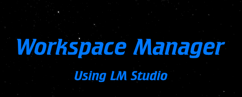

# Workspace Manager

An LCARS inspired workspace manager. Similar to the ship's computer on the Enterprise, this tells you if you're slouching, active or been starting at the screen for too long.

## What It Does

- Serves the main workspace UI from `index.html`
- Proxies Home Assistant service calls through `server.js`
- Sends workspace snapshots to a local LLM endpoint for analysis
- Generates TTS audio responses and serves them from the local `audio/` folder
- Supports HTTPS automatically when local certs are available

## Project Structure

- `server.js` - Express server and API routes
- `index.html` - Main workspace manager UI
*below are some test files *
- `tricorder-display.html` - Tricorder analysis demo UI
- `tricorder-mobile.html` - Mobile-friendly tricorder UI
- `tricorder_camera_stream.py` - Camera stream helper for tricorder features
- `audio/` - Generated speech audio and reference samples
- `data/` - Local runtime data and logs

## Requirements

- npm
- A running Home Assistant instance (although this currently is not usable by users with different set ups than mine)
- A local LLM server such as LM Studio
- An LLM *without* thinking capabilites or with thinking turned off. This would mess with the output!
- Python environment for TTS generation if you want speech output

## Setup

1. Install dependencies:

```bash
npm install
```

2. Review `server.js` and update the local integration settings if needed:
- Home Assistant base URL and token
- LLM base URL and model name
- Python path for TTS generation

3. Start the server:

```bash
npm start
```

For development with automatic restart:

```bash
npm run dev
```

4. Open the app in your browser:
- `http://localhost:3000`

If local TLS certificates are available in `certs/`, the server will try to start over HTTPS instead.

## Runtime Notes

- The server statically serves the repository root, so all HTML files in the project are available directly.
- Generated audio files are written to `audio/` and reused by the UI.
- If TTS is unavailable, the workspace manager still works without speech output.

## API Surface

The current server keeps the small set of routes used by the workspace manager UI:

- `POST /api/service` - Call a Home Assistant service
- `POST /api/workspace/analyze` - Analyze the current workspace state
- `POST /api/tts/speak` - Generate spoken audio for analysis text